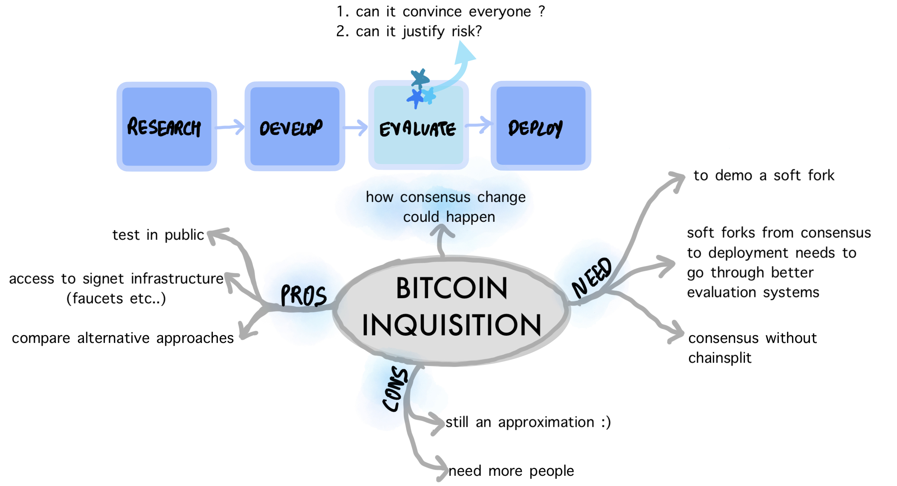
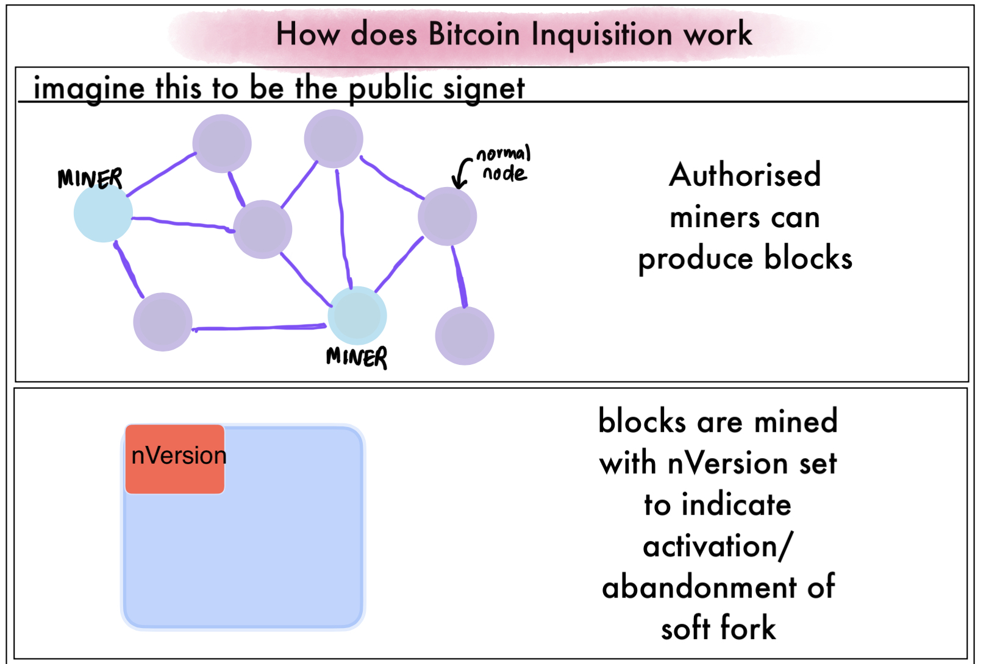
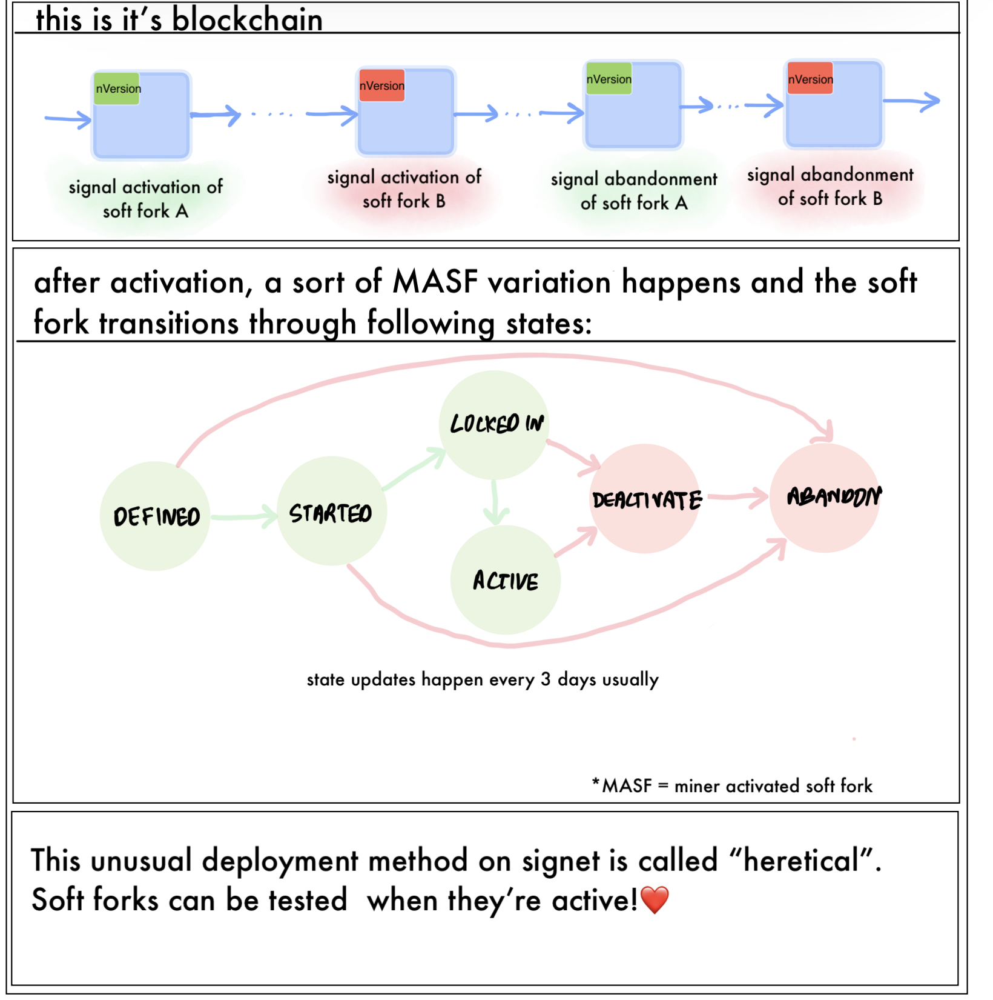

## Summary
----

Bitcoin Inquisition is a fork of Bitcoin Core that only runs on Signet, and has been specifically designed to develop, deploy and
revert consensus-critical soft-fork proposals.
This is important to properly evaluate the merits and use cases and parallelly identify potential bugs of various competing softfork proposals.



This PR is adding a new softfork deployment method into this fork which is analogous to BIP9 deployment but differs in important details. Like mainnet, in this case also, the softfork is signalled via `nVersion` field of the block headers, which the miners of Signet set. Unlike mainnet, because Signet is permissioned, and only designated miners can produce blocks, threshold signalling (95% of blocks in the previous difficulty period) is replaced with direct signalling. I.e., just one block with the activation signalling would lock-in the activation.



The Heretical deployment method is similar to BIP9 but adds a provision to deactivate a softfork. Also, changes the activation period, which is usually 2014 blocks in mainnet, to 432 blocks, to speed up activation and deactivation. Because we don't need consensus for signet softfork activation, we also don't need to wait for a full difficulty adjustment period. The details of the heretical deployment are outlined [here](https://github.com/bitcoin-inquisition/bitcoin/wiki/Heretical-Deployments).

Below is a schematic of the process.




## Why do we want to deploy consensus changes that aren’t merged into Bitcoin Core? What problems (if any) are there with merging the code into Bitcoin Core, and then testing it on signet afterwards?
----
We want to quickly iterate through various versions of consensus-critical softfork proposals without overburdening the Bitcoin Core's development process. Merging consensus changes into Bitcoin Core is an intense process that often results in deadlock due to the lack of overwhelming consensus. This also drains review resources which are already scarce for Core.

Doing the iteration on a parallel fork that doesn't affect the Bitcoin mainnet is a lot more flexible. It's also easier to find bugs and make incompatible fixes on the fork than on Bitcoin Core.

## When have ANYPREVOUT and CHECKTEMPLATEVERIFY been activated on signet according to this logic? If we found a bug and needed to make substantial changes, how would we do that? Would that result in a signet hard fork?
----

As per this PR, `CHECKTEMPLATEVERIFY` is activated at block height 106740. `ANYPREVOUT` hasn't been activated at this PR. But at the time of writing this document, it is activated in the `v0.24` branch at the same block height of `106740`.

Below is the output of `bitcoin-cli getdeploymentinfo` for `v0.24`.
```
"checktemplateverify": {
      "type": "heretical",
      "height": 106704,
      "active": true,
      "heretical": {
        "bip": 119,
        "bip_version": 0,
        "start_time": 1654041600,
        "timeout": 1969660800,
        "period": 432,
        "status": "active",
        "since": 106704,
        "status_next": "active",
        "signal_abandon": "40007700",
        "signals": [
        ]
      }
    },
    "anyprevout": {
      "type": "heretical",
      "height": 106704,
      "active": true,
      "heretical": {
        "bip": 118,
        "bip_version": 0,
        "start_time": 1625875200,
        "timeout": 1941408000,
        "period": 432,
        "status": "active",
        "since": 106704,
        "status_next": "active",
        "signal_abandon": "40007600",
        "signals": [
        ]
      }
```


## What is the point of the DEACTIVATING state?
----

`DEACTIVATING` means a softfork is in the process of deactivating and will be fully deactivated by the next 432 blocks. This window allows users to withdraw their funds from a deactivating softfork. In theory, in signet we could deactivate a softfork immediately after
the deactivation signal by a miner, but this would burn the funds of unsuspecting users.

## Why is min_activation_height removed?
----

Because Signet activation doesn't require consensus, so we don't need to wait any further after the softfork locks in. Thus `min_activation_height` is removed.

# Why is Taproot buried?
After the activation process is a success (BIP9/Heretical), we no longer care about the activation method. So instead of
the parameterised activation state of the softfork, we hardcode the activation height to a specific value in the codebase. This is called
burying a softfork.

For mainnet these hardcoded heights are defined in `CMainParams` class.
`src/chainparams.cpp`
```c++
class CMainParams : public CChainParams {
public:
    CMainParams() {
        strNetworkID = CBaseChainParams::MAIN;
        consensus.signet_blocks = false;
        consensus.signet_challenge.clear();
        consensus.nSubsidyHalvingInterval = 210000;
        consensus.script_flag_exceptions.emplace( // BIP16 exception
            uint256S("0x00000000000002dc756eebf4f49723ed8d30cc28a5f108eb94b1ba88ac4f9c22"), SCRIPT_VERIFY_NONE);
        consensus.script_flag_exceptions.emplace( // Taproot exception
            uint256S("0x0000000000000000000f14c35b2d841e986ab5441de8c585d5ffe55ea1e395ad"), SCRIPT_VERIFY_P2SH | SCRIPT_VERIFY_WITNESS);
        consensus.BIP34Height = 227931;
        consensus.BIP34Hash = uint256S("0x000000000000024b89b42a942fe0d9fea3bb44ab7bd1b19115dd6a759c0808b8");
        consensus.BIP65Height = 388381; // 000000000000000004c2b624ed5d7756c508d90fd0da2c7c679febfa6c4735f0
        consensus.BIP66Height = 363725; // 00000000000000000379eaa19dce8c9b722d46ae6a57c2f1a988119488b50931
        consensus.CSVHeight = 419328; // 000000000000000004a1b34462cb8aeebd5799177f7a29cf28f2d1961716b5b5
        consensus.SegwitHeight = 481824; // 0000000000000000001c8018d9cb3b742ef25114f27563e3fc4a1902167f9893
        consensus.TaprootHeight = 709632; // 0000000000000000000687bca986194dc2c1f949318629b44bb54ec0a94d8244
```


## What is the purpose of AbstractThresholdConditionChecker and ThresholdConditionCache in versionbits.h?

The `AbstractThresholdConditionChecker` is an abstract class that checks the deployment status of various softforks by looking at
the version bits of block headers.

`src/versionbits.h`
```c++
/**
 * Abstract class that implements BIP9-style threshold logic, and caches results.
 */
class AbstractThresholdConditionChecker {
protected:
    virtual int64_t BeginTime() const =0;
    virtual int64_t EndTime() const =0;
    virtual int Period() const =0;
    virtual int32_t ActivateVersion() const =0;
    virtual int32_t AbandonVersion() const =0;

public:
    /** Returns the state for pindex A based on parent pindexPrev B. Applies any state transition if conditions are present.
     *  Caches state from first block of period. */
    ThresholdState GetStateFor(const CBlockIndex* pindexPrev, ThresholdConditionCache& cache) const;
    /** Returns the height since when the ThresholdState has started for pindex A based on parent pindexPrev B, all blocks of a period share the same */
    int GetStateSinceHeightFor(const CBlockIndex* pindexPrev, ThresholdConditionCache& cache) const;

    /** Report bip number and version, based on nVersion signalling standard */
    bool BIP(int& bip, int& version) const;

    /** Returns signalling information */
    std::vector<SignalInfo> GetSignalInfo(const CBlockIndex* pindex) const;
};
```

## Do any of the changes here make sense to include in Bitcoin Core?

These changes mostly include the Heretical deployment method, which is not applicable to Bitcoin Core in any way.
Apart from that, only the Taproot deployment burying change makes sense for Bitcoin Core, for which there already exists
an open PR https://github.com/bitcoin/bitcoin/pull/26201